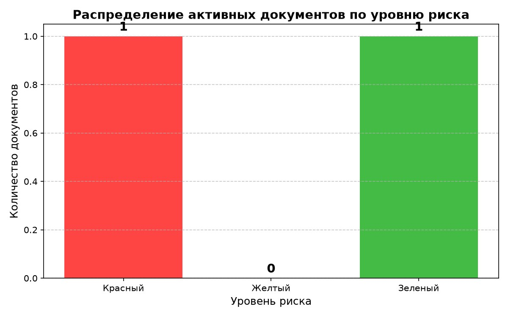

# Интеллектуальный Telegram-бот для мониторинга поручений и классификации рисков документов

Интеллектуальный ассистент на базе Telegram API и NLP-модели семейства RuBERT (`DeepPavlov/rubert-base-cased`). Бот разработан для автоматизации обработки нормативно-правовых актов, официальных писем и перечней поручений, оперативного контроля дедлайнов и интеллектуального анализа текстов.


## Команды бота
**Команда	Описание**
/start	Начать работу с ботом
/check	Показать все активные задачи
/urgent	Показать срочные задачи (дедлайн сегодня/завтра)
/done	Отметить документ(ы) выполненными
/archive	Показать архив выполненных документов
/search <слово>	Поиск документов по ключевому слову
/chart	График распределения документов по рискам
/export	Экспорт всех документов в Excel
/cancel	Отменить текущее действие

## Основные возможности
- **Умное извлечение текста (Парсинг):** Прямая обработка и чтение документов форматов `.docx` и `.pdf` (на базе библиотек `python-docx` и `PyMuPDF`).
- **Краткое содержание (Summary):** Алгоритм выделения главного мысли текста с отсечением "шапок", официальных обращений, ФИО и склеиванием сути с найденными сроками.
- **ML-классификация рисков:** Определение уровня критичности и важности документа (🔴 *Красный* / 🟡 *Желтый* / 🟢 *Зеленый*) с помощью дообученной нейросети BERT.
- **Автоматический планировщик задач:** Ежедневная утренняя отправка сводки активных и горящих задач пользователю с помощью `APScheduler`.
- **Аналитика и отчетность:** - Визуализация распределения актуальных документов по уровням риска в виде графиков (`Matplotlib`).
  - Экспорт полного структурированного реестра задач в формат Excel (`Pandas`, `openpyxl`).
- **Модульное тестирование (Уровень CI/CD):** Покрытие кодовой базы автоматическими тестами (`unittest`), проверяющими как строковую логику суммаризации, так и качество предсказаний нейросети на письмах.

## Стек технологий
- **Backend:** Python, pyTelegramBotAPI, APScheduler
- **Data Science / ML:** PyTorch, Transformers (Hugging Face), Pandas, Scikit-learn, Matplotlib
- **Парсинг и документы:** PyMuPDF (fitz), python-docx, openpyxl
- **Тестирование:** Unittest

## Автор
**Павел Анисенков – @lust4d**

## Тест бота
Пользователь направляет боту файл mainfile (2).pdf

Ответ бота:
📄 Текст документа mainfile (2).pdf получен.
🔍 В тексте найдена дата дедлайна: 2023-10-15
✅ Если дата верна, напишите Да.
✏️ Если хотите указать другую дату, просто введите её в формате ДД.ММ.ГГГГ.

Ответ пользователя: да

Ответ бота:
📁 Документ: mainfile (2).pdf
📄 Краткое содержание:
> в соответствии с которым внедрение в субъектах Российской Федерации решений, реализованных на типовых компонентах платформы "ГосТех", и обеспечение их инфраструктурой, осуществляется Минцифры России в рамках средств федерального бюджета. Срок - до 25 декабря 2023 г. (в тексте есть перечень поручений! Рекомендуется ручное ознакомление)
🔴 ВЫСОКИЙ УРОВЕНЬ ВАЖНОСТИ
📌 Причины: Высокий уровень риска документа по ML-модели; Документ просрочен на 988 дней
⏳ До дедлайна: Просрочка
💡 Рекомендация: Срочно принять меры!
✅ Документ сохранён в память.


Пользователь направляет боту файл письмо_от_29.04.docx

Ответ бота:
📄 Текст документа письмо18.docx получен.
🔍 В тексте найдена дата дедлайна: 2026-07-15
✅ Если дата верна, напишите Да.
✏️ Если хотите указать другую дату, просто введите её в формате ДД.ММ.ГГГГ.

Ответ пользователя: Да

Ответ бота:
📁 Документ: письмо_от_29.04.docx
📄 Краткое содержание:
> Направляем протокол заседания комиссии Государственного Совета по направлению «Промышленность» от 29 апреля 2026 года № 2. Просим ознакомиться и направить замечания до 15.07.2026.
🟢 НИЗКИЙ УРОВЕНЬ ВАЖНОСТИ
📌 Причины: Низкий уровень риска документа по ML-модели
⏳ До дедлайна: 16 дн.
💡 Рекомендация: Можно выполнить в штатном режиме.
✅ Документ сохранён в память.


Пользователь направляет боту файл письмо_от_03.06.docx

Ответ бота:
📄 Текст документа письмо33.docx получен.
🔍 В тексте найдена дата дедлайна: 2026-06-18
✅ Если дата верна, напишите Да.
✏️ Если хотите указать другую дату, просто введите её в формате ДД.ММ.ГГГГ.

Ответ пользователя: ДА

📁 Документ: письмо_от_03.06.docx
📄 Краткое содержание:
> Просим подтвердить участие профильных специалистов до 18.06.2026. Совещание состоится 19.06.2026 в 12:00.
🔴 ВЫСОКИЙ УРОВЕНЬ ВАЖНОСТИ
📌 Причины: Средний уровень риска документа по ML-модели; Документ просрочен на 11 дней
⏳ До дедлайна: Просрочка
💡 Рекомендация: Срочно принять меры!
✅ Документ сохранён в память.

Пользователь нажимает на кнопку "Ввести текст"

Ответ бота: 📝 Вставьте текст документа в чат.

Ответ пользователя:
ООО «ГлавСтрой» уведомляет о необходимости предоставить акты выполненных работ
по форме КС-2 и справки КС-3 до 25.06.2025. В случае задержки будут применены 
штрафные санкции в размере 0,1% за каждый день просрочки.

Ответ бота:
📄 Текст документа получен.
📝 Введите название документа (например: Письмо от 25.06.2025).
Это поможет вам ориентироваться в списке задач.

Ответ пользователя: АктыКС-2

Ответ бота:
📄 Документ: АктыКС-2
🔍 В тексте найдена дата дедлайна: 2025-06-25
✅ Если дата верна, напишите Да.
✏️ Если хотите указать другую дату, просто введите её в формате ДД.ММ.ГГГГ.

Ответ пользователя: 02.07.2026

Ответ бота:
📁 Документ: АктыКС-2
📄 Краткое содержание:
> ООО «ГлавСтрой» уведомляет о необходимости предоставить акты выполненных работ по форме КС-2 и справки КС-3 до 25.06.2025. В случае задержки будут применены штрафные санкции в размере 0,1% за каждый день...
🔴 ВЫСОКИЙ УРОВЕНЬ ВАЖНОСТИ
📌 Причины: Высокий уровень риска документа по ML-модели; Остался 1 день!
⏳ До дедлайна: 1 дн.
💡 Рекомендация: Срочно принять меры!
✅ Документ сохранён в память.


Пользователь нажимает на кнопку "Все задачи"

Ответ бота:
📋 Все активные задачи:

1. 🔴 ВЫСОКИЙ (ML уверенность: 71%)
   📁 Файл: mainfile (2).pdf
   📄 в соответствии с которым внедрение в субъектах Российской Федерации решений, реализованных на типовых компонентах платформы "ГосТех", и обеспечение их инфраструктурой, осуществляется Минцифры России в рамках средств федерального бюджета. Срок - до 25 декабря 2023 г. (в тексте есть перечень поручений! Рекомендуется ручное ознакомление)
   ⏳ Дедлайн: 2023-10-15 (Просрочка!)

2. 🔴 ВЫСОКИЙ (ML уверенность: 78%)
   📁 Файл: АктыКС-2
   📄 ООО «ГлавСтрой» уведомляет о необходимости предоставить акты выполненных работ по форме КС-2 и справки КС-3 до 25.06.2025. В случае задержки будут применены штрафные санкции в размере 0,1% за каждый день...
   ⏳ Дедлайн: 2026-07-02 (1 дн.)

3. 🔴 ВЫСОКИЙ (ML уверенность: 47%)
   📁 Файл: письмо_от_03.06.docx
   📄 Просим подтвердить участие профильных специалистов до 18.06.2026. Совещание состоится 19.06.2026 в 12:00.
   ⏳ Дедлайн: 2026-06-18 (Просрочка!)

4. 🟢 НИЗКИЙ (ML уверенность: 67%)
   📁 Файл: письмо_от_29.04.docx
   📄 Направляем протокол заседания комиссии Государственного Совета по направлению «Промышленность» от 29 апреля 2026 года № 2. Просим ознакомиться и направить замечания до 15.07.2026.
   ⏳ Дедлайн: 2026-07-15 (14 дн.)


Пользователь нажимает на кнопку "Отметить выполненным"

Ответ бота:
📋 Выберите номера документов для отметки выполненными:
1. 🔴 mainfile (2).pdf — в соответствии с которым внедрение в субъектах Российской Федерации решений, реализованных на типовых компонентах платформы "ГосТех", и обеспечение их инфраструктурой, осуществляется Минцифры России в рамках средств федерального бюджета. Срок - до 25 декабря 2023 г. (в тексте есть перечень поручений! Рекомендуется ручное ознакомление)
2. 🟢 письмо_от_29.04.docx — Направляем протокол заседания комиссии Государственного Совета по направлению «Промышленность» от 29 апреля 2026 года № 2. Просим ознакомиться и направить замечания до 15.07.2026.
3. 🔴 письмо_от_03.06.docx — Просим подтвердить участие профильных специалистов до 18.06.2026. Совещание состоится 19.06.2026 в 12:00.
4. 🔴 АктыКС-2 — ООО «ГлавСтрой» уведомляет о необходимости предоставить акты выполненных работ по форме КС-2 и справки КС-3 до 25.06.2025. В случае задержки будут применены штрафные санкции в размере 0,1% за каждый день...
Введите номера через пробел или запятую.

Ответ пользователя: 1 3

Ответ бота:
✅ Отмечено выполненными 2 документов: mainfile (2).pdf, письмо_от_03.06.docx.


Пользователь нажимает на кнопку "Срочные задачи"

Ответ бота:
🔥 Срочные задачи (дедлайн сегодня/завтра):
1. 🔴 ВЫСОКИЙ (ML уверенность: 78%)
   📁 Файл: АктыКС-2
   📄 ООО «ГлавСтрой» уведомляет о необходимости предоставить акты выполненных работ по форме КС-2 и справки КС-3 до 25.06.2025. В случае задержки будут применены штрафные санкции в размере 0,1% за каждый день...
   ⏳ Дедлайн: 2026-07-02 (1 дн.)

Пользователь нажимает на кнопку "Архив"
Ответ бота:
📦 Выполненные документы:

1. 📁 mainfile (2).pdf
   📄 в соответствии с которым внедрение в субъектах Российской Федерации решений, реализованных на типовых компонентах платформы "ГосТех", и обеспечение их инфраструктурой, осуществляется Минцифры России в рамках средств федерального бюджета. Срок - до 25 декабря 2023 г. (в тексте есть перечень поручений! Рекомендуется ручное ознакомление)...
   ⏳ Дедлайн был: 2023-10-15

2. 📁 письмо_от_03.06.docx
   📄 Просим подтвердить участие профильных специалистов до 18.06.2026. Совещание состоится 19.06.2026 в 12:00....
   ⏳ Дедлайн был: 2026-06-18

Пользователь нажимает на кнопку "Очистить Архив"

Ответ бота:
🗑️ Очистка архива
Выберите действие:

Ответ пользователя: 🔢 Выборочно удалить

Ответ бота: 📋 Выберите документы для удаления из архива:

1. 📁 mainfile (2).pdf — в соответствии с которым внедрение в субъектах Российской Федерации решений, реализованных на типовых компонентах платформы "ГосТех", и обеспечение их инфраструктурой, осуществляется Минцифры России в рамках средств федерального бюджета. Срок - до 25 декабря 2023 г. (в тексте есть перечень поручений! Рекомендуется ручное ознакомление)... (дедлайн: 2023-10-15)
2. 📁 письмо_от_03.06.docx — Просим подтвердить участие профильных специалистов до 18.06.2026. Совещание состоится 19.06.2026 в 12:00.... (дедлайн: 2026-06-18)

Введите номера документов через пробел или запятую.

Ответ пользователя: 1,2

Ответ бота: ✅ Успешно удалено 2 документов из архива: mainfile (2).pdf, письмо_от_03.06.docx.

Пользователь нажимает на кнопку "График рисков"

Ответ бота:
📊 Статистика по рискам:
📄 Всего активных: 2
🔴 Высокий риск: 1
🟡 Средний риск: 0
🟢 Низкий риск: 1


Пользователь нажимает на кнопку "Поиск"

Ответ бота:
📝 Введите слово для поиска: /search <слово>
Например: /search штраф

Ответ пользователя: /search задержк

Ответ бота:
🔍 Результаты поиска: 'задержк'
📄 Найдено документов: 1
1. 🔴 АктыКС-2
   📝 ООО «ГлавСтрой» уведомляет о необходимости предоставить акты...
   ⏳ Дедлайн: 2026-07-02

Пользователь нажимает на кнопку "Экспорт в Excel"

Ответ бота:

📊 Экспорт данных
**файл export.xlsx**
📄 Всего документов: 2
✅ Выполнено: 0
⏳ Активных: 2

(ключевые столбцы файла:
Файл Риск Дедлайн Статус Краткое содержание Создан)


Вывод пользователю от бота списка актуальных задач каждый день в определенное время:
☀️ Доброе утро! Напоминание об активных задачах:

1. 🔴 ВЫСОКИЙ (ML уверенность: 78%)
   📁 Файл: АктыКС-2
   📄 ООО «ГлавСтрой» уведомляет о необходимости предоставить акты выполненных работ по форме КС-2 и справки КС-3 до 25.06.2025. В случае задержки будут применены штрафные санкции в размере 0,1% за каждый день...
   ⏳ Дедлайн: 2026-07-02 (1 дн.)

2. 🟢 НИЗКИЙ (ML уверенность: 67%)
   📁 Файл: письмо_от_29.04.docx
   📄 Направляем протокол заседания комиссии Государственного Совета по направлению «Промышленность» от 29 апреля 2026 года № 2. Просим ознакомиться и направить замечания до 15.07.2026.
   ⏳ Дедлайн: 2026-07-15 (14 дн.)

## Структура проекта
```text
RiskBot/
│
├── venv/                  # Изолированное виртуальное окружение со всеми зависимостями
├── model/                 # Локальная папка с сохраненными весами дообученной ML-модели
├── tests/                 # Автоматические тесты
│   └── test_summary.py    # Тесты для get_summary() и ML-классификатора рисков
│
├── TGbot.py               # Основной исполняемый скрипт Telegram-бота
├── train_model.py         # Скрипт для проведения Fine-Tuning модели RuBERT на датасете рисков
├── documents.json         # Локальная база данных (реестр документов)
├── requirements.txt       # Зафиксированные версии библиотек проекта
└── .gitignore             # Исключения Git (скрывает токены, venv, базы данных и тяжелые веса модели)

